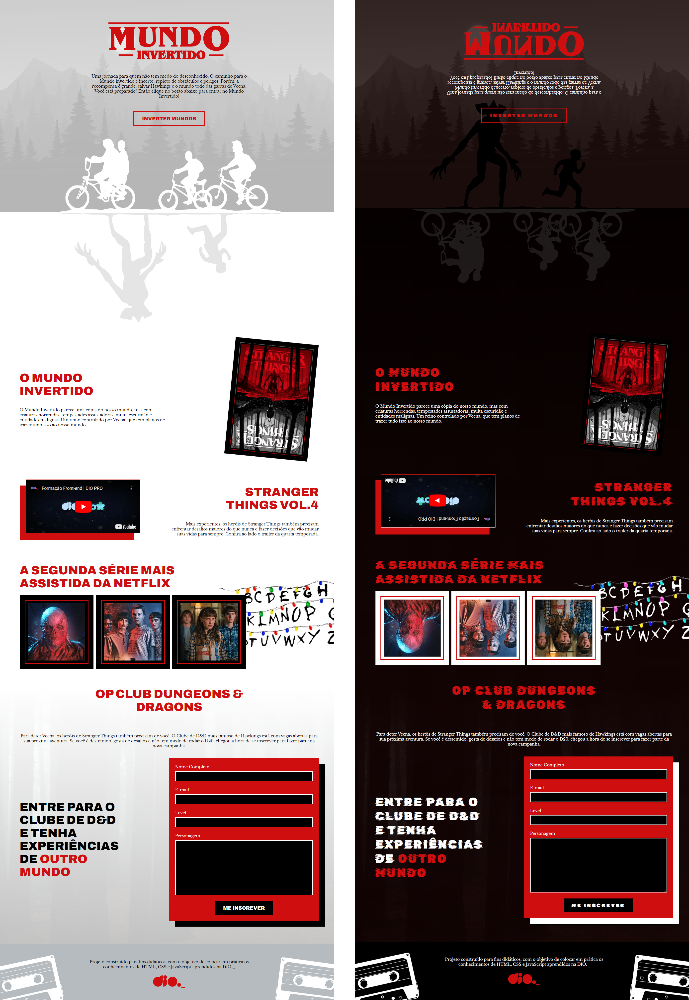

<h1 align="center"> Mundo Invertido </h1>

Projeto desenvolvido, juntamente com a escola DIO, colocando em prática os conhecimentos. Interface responsiva de uma página inspirada na série "Stranger Things", com theme switcher (light/dark).

<!-- 

  <a href="#-tecnologias">Tecnologias</a>&nbsp;&nbsp;&nbsp;|&nbsp;&nbsp;&nbsp;
  <a href="#-projeto">Projeto</a>&nbsp;&nbsp;&nbsp;|&nbsp;&nbsp;&nbsp;
  <a href="#-layout">Layout</a>&nbsp;&nbsp;&nbsp;|&nbsp;&nbsp;&nbsp;
  <a href="#memo-licença">Licença</a>

 -->

  

 

**_[Deploy do projeto](https://mundo-invertido-stranger-things.vercel.app)_**

## 🚀 Tecnologias

Esse projeto foi desenvolvido com as seguintes tecnologias:

- HTML e CSS
- JavaScript (Vanila)

## 💻 Projeto

Criado em um evento, praticando meus conhecimentos em semantica e acessíbilidade, animações e manipulação via DOMe. Interface inspirada na série "Stranger Things". Estarei aperfeiçoando esta página ao ponto que meus conhecimento aumentem.

upgrade: (partes não abordadas no evento)
- manipulação de atualizar elementos HTML via DOM.

## 🔖 Layout

O layout apresentado foi desenvolvido pela escola DIO

    

